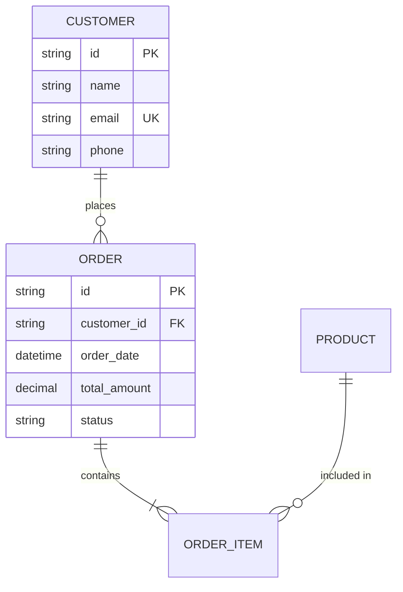

# ERDwithAI

**AI-Powered Entity Relationship Design & Code Generation Platform**

Transform natural language descriptions into production-ready full-stack applications with AI-powered entity extraction, human-in-the-loop approvals, and comprehensive code generation.

---

## ✨ Features

### AI-Powered Design
- 🤖 **Natural Language Analysis** - Describe your domain in plain English
- 👥 **Human-in-the-Loop** - Review and approve AI suggestions
- 🎯 **Smart Entity Extraction** - Automatic detection of entities and relationships
- 💬 **Interactive UI** - Conversational interface for design approval
- 🎨 **Visual ERD Designer** - Browser-based Mermaid ERD editor

### Code Generation
- ⚡ **Modern Web Stack** - TanStack Start + Shadcn UI + TanStack Query
- 🏢 **Enterprise Backend** - NestJS + Fastify + Knex.js
- 🌐 **OData V4 Services** - RESTful OData with jaystack
- 📱 **OpenUI5 FCL** - SAP-style Flexible Column Layout apps
- 🧪 **Auto-Generated E2E Tests** - Playwright tests for all generated apps

### Dictionary-Driven Architecture
- 📚 **Application Dictionary** - Compiere-inspired metadata management
- 🔐 **Built-in RBAC** - Table, record, and field-level access control
- 🎨 **Template-Based Generation** - Handlebars templates for all code
- 📊 **Runtime UI Configuration** - Modify field order at runtime

---

## 🚀 Quick Start

### Prerequisites

```bash
# Install Bun.js (REQUIRED runtime)
curl -fsSL https://bun.sh/install | bash

# Verify installation
bun --version  # >= 1.1.0
```

### Developer Tools (gstack)

This project uses **gstack** - a collection of AI-powered development skills for Claude Code that enhance code review, testing, and deployment workflows.

**Setup gstack** (one-time setup per developer):

```bash
# Quick setup script
./scripts/setup-gstack.sh

# Or manual installation
git clone --single-branch --depth 1 https://github.com/garrytan/gstack.git ~/.claude/skills/gstack && cd ~/.claude/skills/gstack && ./setup
```

**Available gstack skills:**
- `/browse` - Headless browser for web browsing and QA testing
- `/review` - Code review before merge
- `/qa` - Full QA testing of the app
- `/ship` - Ready to deploy / create PR
- `/office-hours` - Brainstorming and idea exploration
- `/plan-eng-review` - Architecture/engineering plan review
- And many more...

See [CLAUDE.md](CLAUDE.md) for complete gstack documentation.

### Installation

```bash
# 1. Install dependencies
bun install

# 2. Configure environment
cp .env.example .env
# Edit .env with your ANTHROPIC_API_KEY

# 3. Run database migrations
bun run migrate

# 4. Start development server
bun run dev
```

### Access the Application

- **Web App**: http://localhost:3000
- **Visual Designer**: http://localhost:3000/designer
- **Dashboard**: http://localhost:3000/dashboard

---

## 💡 Usage Examples

### Example 1: Visual ERD Designer

```bash
# 1. Open http://localhost:3000/designer
# 2. Create your ERD using Mermaid syntax
# 3. Click "Generate Code" to see Knex.js migrations and SQL DDL
```

**Example ERD:**


### Example 2: CLI Converter

```bash
# Convert natural language to Mermaid
erdwithai-convert "E-commerce with products, categories, orders" -o shop.mermaid

# Fast mode (programmatic)
erdwithai-convert -i description.txt --fast

# Analysis only
erdwithai-convert "CRM system" --analyze-only --json > analysis.json
```

### Example 3: Generate Full-Stack Application

```bash
# 1. Create ERD (using designer or CLI)
erdwithai-convert "Blog platform" -o blog.mermaid

# 2. Generate Modern Web Stack (tanstack-start-nestjs)
bun run generate:tanstack -- -i blog.mermaid -o ./generated/blog-app

# 3. Or Generate Enterprise SAP-Style Stack (openui5-odatav4)
bun run generate:odata -- -i blog.mermaid -o ./generated/blog-api
```

---

## 📦 Package Structure

```
erdwithai/
├── packages/
│   ├── core/       # Core business logic, types, hooks, RBAC
│   ├── generator/  # Code generation engine & Handlebars templates
│   ├── ai/         # AI features (Mastra.ai agents, CopilotKit)
│   └── web/        # TanStack Start web application
├── docs/           # Documentation
│   ├── ARCHITECTURE.md   # System architecture & code style guide
│   ├── DEVELOPMENT.md    # Build system, commands, running the app
│   ├── TESTING.md        # E2E test generation & execution
│   └── ROADMAP.md        # Version 6.0 plans & feature roadmap
├── tests/          # Test suites
└── migrations/     # Database migrations
```

---

## 🏗️ Architecture

### AI-Powered Workflow

```
Natural Language Input
    ↓
Domain Agent (Extract entities & relationships)
    ↓
Entity Agent (Refine structure & types)
    ↓
Human Approval (Review each entity)
    ↓
Relationship Agent (Determine cardinality)
    ↓
Human Approval (Review relationships)
    ↓
Mermaid Agent (Generate ERD)
    ↓
Dictionary Populator (Create AD_Table, AD_Column records)
    ↓
Code Generator (Template-based generation)
    ↓
Generated Application (TanStack Start/NestJS or OpenUI5/OData)
```

### Technology Stack

| Layer | Technologies |
|-------|-------------|
| **Runtime** | Bun.js 1.3+ |
| **AI Framework** | Mastra.ai, CopilotKit |
| **AI Model** | Anthropic Claude Sonnet 4 |
| **Frontend** | TanStack Start 1+, Vite 5+, React 18+, Shadcn UI, TailwindCSS |
| **Backend** | NestJS 10+, Fastify, Kysely (type-safe SQL) |
| **OData** | jaystack/odata-v4-server |
| **UI Framework** | OpenUI5 1.120+ (FCL) |
| **Database** | PostgreSQL, SQLite |
| **Templates** | Handlebars 4.7+ |
| **Validation** | Zod 3.22+ |
| **Testing** | Playwright, Vitest |

---

## 🛠️ Development

### Commands

```bash
# Installation
bun install

# Development
bun run dev          # Web app (http://localhost:3000)
bun run dev:mastra   # AI server (if using standalone AI)

# Building
bun run build        # Build all packages
bun run build:core    # Build @erdwithai/core
bun run build:web     # Build @erdwithai/web

# Code Quality
bun run lint         # ESLint
bun run type-check   # TypeScript checking

# Testing
bun run test         # Run all tests
bun run test:e2e     # E2E tests (with auto-start server)

# Code Generation
bun run convert      # Convert natural language to Mermaid
bun run migrate      # Run database migrations
bun run generate:tanstack   # Generate TanStack Start app
bun run generate:odata      # Generate OData V4 service
bun run generate:ui5        # Generate OpenUI5 app
```

### Build Status

✅ **All packages build successfully**
- @erdwithai/core: 124.75 KB (27 modules)
- @erdwithai/generator: 220.68 KB (51 modules)
- @erdwithai/ai: 44.7 KB (including Mastra)
- @erdwithai/web: TanStack Start optimized build

---

## 📖 Documentation

| Document | Description |
|----------|-------------|
| **[ARCHITECTURE.md](docs/ARCHITECTURE.md)** | System architecture, package descriptions, code style guidelines |
| **[DEVELOPMENT.md](docs/DEVELOPMENT.md)** | Build system, development commands, migration history |
| **[TESTING.md](docs/TESTING.md)** | E2E test generation, test infrastructure, running tests |
| **[ROADMAP.md](docs/ROADMAP.md)** | Version 6.0 plans, features, implementation phases |

### Additional Resources

- **AI Package**: `packages/ai/README.md` - Agent API and workflows
- **Generator**: `packages/generator/README.md` - Template customization
- **Tests**: `tests/README.md` - Testing guide and test data

---

## 🧪 Testing

### E2E Testing

Generated applications include comprehensive E2E tests using Playwright:

- ✅ Navigation tests
- ✅ Entity CRUD tests
- ✅ Form validation
- ✅ API endpoint tests
- ✅ Auto-generated test data fixtures

### Run Tests

```bash
# Run all E2E tests (auto-starts server)
bun run test:e2e:server

# Run specific test suite
bun test tests/e2e/comprehensive-all-frameworks.e2e.spec.ts

# Run with browser visible
HEADLESS=false bun test tests/e2e/
```

See [tests/README.md](tests/README.md) for complete testing documentation.

---

## 🚢 Deployment

### Production Build

```bash
# Build all packages
bun run build

# Start production server
bun run start              # Web app
```

### Environment Variables

**Required:**
- `ANTHROPIC_API_KEY` - Your Anthropic API key for AI features
- `DATABASE_URL` - PostgreSQL connection string

**Optional:**
- `MASTRA_DATABASE_URL` - Mastra state database (default: SQLite)
- `VITE_APP_URL` - Application URL (default: http://localhost:3000)
- `CORS_ORIGIN` - CORS allowed origins

See `.env.example` for complete list.

---

## 🔒 Security

- **API Keys**: Store in environment variables, never commit
- **RBAC**: Built-in role-based access control
- **SQL Injection**: Protected via Knex.js parameterized queries
- **XSS**: Protected via React's built-in sanitization
- **CORS**: Configurable via environment variable

---

## 📊 What's New

### Recent Updates (v5.1 - February 2026)

✅ **Bun.js Migration Complete**
- Migrated from npm/yarn to Bun.js runtime
- 3x faster package installation
- 2x faster build times
- Native TypeScript support

✅ **Visual ERD Designer**
- Browser-based Mermaid ERD editor
- Live preview and validation
- Import/export functionality
- Code generation preview

✅ **Comprehensive E2E Testing**
- Playwright-based E2E tests auto-generated
- Tests for all framework options
- 90%+ test pass rate

✅ **Documentation Consolidation**
- 4 focused documentation files (down from 42)
- Organized test suite (down from 6.7GB to 784KB)
- Clear developer guides

---

## 🗺️ Roadmap

### Version 6.0 - In Planning

**Complete Multi-Stack Generation with Application Dictionary**

- System Tables (sys_ prefix) for metadata
- Business Tables (bus_ prefix) for user entities
- Runtime UI layout modification
- Admin interface for field configuration
- Two complete stack options (Modern Web & Enterprise SAP)

See [docs/ROADMAP.md](docs/ROADMAP.md) for complete roadmap.

---

## 🤝 Contributing

1. Fork the repository
2. Create your feature branch (`git checkout -b feature/amazing-feature`)
3. Commit your changes (`git commit -m 'Add amazing feature'`)
4. Push to the branch (`git push origin feature/amazing-feature`)
5. Open a Pull Request

---

## 📄 License

MIT License - See LICENSE file for details

---

## 🙏 Acknowledgments

- **Anthropic** - Claude AI model
- **Mastra.ai** - Agent orchestration framework
- **CopilotKit** - Conversational UI components
- **Compiere/iDempiere** - Dictionary architecture inspiration
- **Shadcn** - Beautiful UI components
- **TanStack** - Modern web framework

---

## 📞 Support

- **Documentation**: See `docs/` directory
- **Issues**: GitHub Issues
- **Architecture**: [docs/ARCHITECTURE.md](docs/ARCHITECTURE.md)
- **Development**: [docs/DEVELOPMENT.md](docs/DEVELOPMENT.md)

---

**Version**: 5.1.0
**Status**: Production Ready ✅
**Last Updated**: February 2026
**Runtime**: Bun.js 1.3+
**Node**: v20+ compatible
