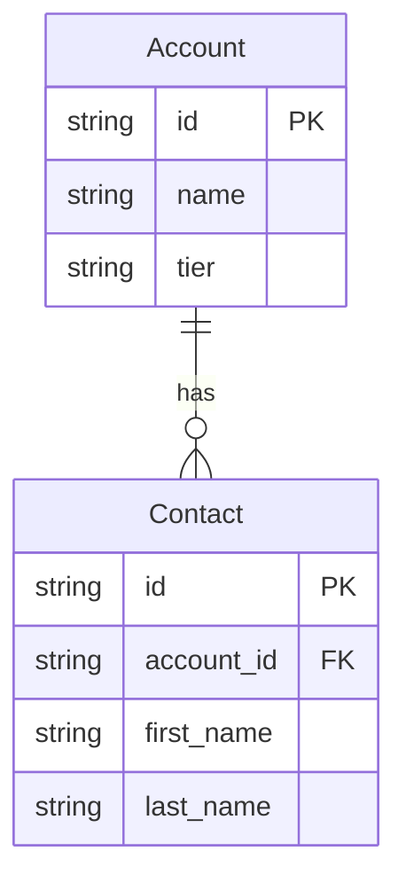

# APPWITHAI

Describe a business in one Mermaid file; get a running application.

APPWITHAI compiles **EML** — a Mermaid-based modelling language for entities,
business rules, workflows and access control — into a complete full-stack
application: PostgreSQL schema, NestJS API, TanStack Start front end, role
accounts, seeded data, an audit trail and a generated manual describing all of
it.

The language, the checker and the guide are published at
**[appwithai.org](https://appwithai.org)**, where you can also generate and run
an application in your own browser tab without installing anything.

> **This is an early version.** The generator works and is exercised end to end
> by CI on every commit, but the project is young: interfaces move, the language
> is still gaining directives, and some surfaces are further along than others
> (`html/run-real-stack.html`'s boot path, for one, has never been watched
> working from here). Treat generated applications as a starting point you own
> and edit, not as something to put in front of customers unreviewed. Issues and
> pull requests are welcome.

---

## What it produces

One model produces **two** applications, from the same pipeline:

| | `appwithai` / `appwithai-wasm generate` | `appwithai-wasm generate --standalone` |
|---|---|---|
| What it is | the real stack — NestJS + TanStack Start, ~409 files | a self-contained app that boots in a browser tab |
| Database | PostgreSQL (or PostgreSQL compiled to WebAssembly) | PGlite, in the visitor's IndexedDB |
| Cost | `npm install` and a build | none — no install, no bundler |
| Trade | the editable source | no per-entity source to open |

Both carry the same things: the Application Dictionary that drives every screen,
role-scoped navigation, business rules, state machines and sagas, an audit
trail, sample data, and `manual.html`.

## Quick start

```bash
bun install

# The real stack, with a docker-compose.yml that brings up Postgres,
# the API and the web front end.
bun packages/generator/src/cli/generate.ts generate \
  --input language/examples/crm.eml.mmd \
  --output ./crm --name "Acme CRM" --force --no-setup
cd crm && cp .env.example .env && docker compose up --build

# Or the browser build — no install, no database server.
bun run wasm generate -i language/examples/crm.eml.mmd \
  -o ./crm-browser --standalone --force --vendor-pglite
bun run wasm serve ./crm-browser        # http://localhost:4000
```

Sign in as `admin@admin.com` / `admin`. The sign-in screen lists every seeded
account — one per functional role the model declares — with the number of
entities that role can see, because an application you can only enter as the
administrator is one whose access control you cannot look at.

## The modelling tool

The CLI is one front door; the other is a web application with an AI pipeline
that turns a natural-language description into a model, a human-in-the-loop
approval gate, and visual editors for the ERD, the rules and the processes.

```bash
./scripts/start-llm.sh   # a local OpenAI-compatible model on :8000
bun run dev              # the modelling tool on :3000
bun run dev:mastra       # the agent service on :4111
```

It calls a **local** OpenAI-compatible endpoint by default — nothing is sent to
a hosted model unless you point `LOCAL_AI_BASE_URL` at one.

## EML, in one screenful



Every EML document is valid, renderable Mermaid — the generator's semantics ride
on `%%` comments that renderers ignore, so a model opens in any Mermaid viewer.

`language/appwithai-language.json` is the canonical definition. The full
specification, written for language models, is `llmtext/llms-full.txt`.

### Validating a model

```bash
bun language/checker.ts language/examples/crm.eml.mmd   # 128 diagnostics
bun language/fixer.ts   language/examples/crm.eml.mmd.error
```

The same two engines are published as ES modules at
`appwithai.org/guide/checker.js` and `…/fixer.js`, so a language model can check
its own output before handing it to anyone.

## The generated manual

Generation writes `manual.html` beside the application: every entity, every
field with its control type and its help text, the relationships between them,
the state machine each entity moves through, the rules that fire on it, and
which roles may see it. It is one self-contained HTML file — no stylesheet, no
script, no font — so it opens out of the zip, off a static host and through the
browser build's Service Worker alike, and the dashboard of both applications
carries a **Manual** button pointing at it.

It is derived from the same parsed model the schema and the guards are derived
from, so it cannot describe an entity that does not exist or miss one that does.
Its prose is only as good as the model's `%%entity help:` and `%%field help:`
text — where those are missing, the manual says so rather than rendering a blank
cell.

## Repository layout

```
packages/core/         types, services, auth, hooks, rules, the sole DB config
packages/generator/    the generation engine, both CLIs, and the templates
packages/ai/           Mastra agents, the converter, pgvector retrieval
packages/web/          the modelling tool (TanStack Start, Vite, React 19)
language/              EML: the definition, checker, fixer, spec and examples
html/                  the static guide and the two live in-browser pages
database/              migrations for the modelling tool's own database
```

## Development

```bash
bun run type-check           # the root tsconfig
bun run type-check:language  # language/** has its own config
bun run lint                 # Biome
bun run test                 # Vitest
bun run test:wasm            # the browser stack, end to end, in Chromium
```

`AGENTS.md` / `CLAUDE.md` in the repository root is the long-form guide: what
each package decided and why, which files are build output, and what CI asserts.
Read it before changing the templates or the generated bundles.

**Four artifacts are checked in and CI verifies they are not stale.** After
editing `packages/generator/templates/wasm/**` or `templates/wasm-overlay/**`,
run these from the repository root:

```bash
bun run build:wasm-runtime
bun run build:wasm-browser
bun run build:fullstack-browser
bun run build:language-tools
```

## Requirements

- **Bun** ≥ 1.3.14 — this repository is bun-only; `npm` and `pnpm` are not used
- **PostgreSQL** with `pgvector`, for the modelling tool (generated apps need
  only stock PostgreSQL, or none at all in the browser build)
- **Docker**, optionally, to bring a generated application up with one command

## Licence

[Apache License 2.0](LICENSE). Applications you generate are yours — the licence
covers this repository, not the models you write or the applications it writes
for you.
