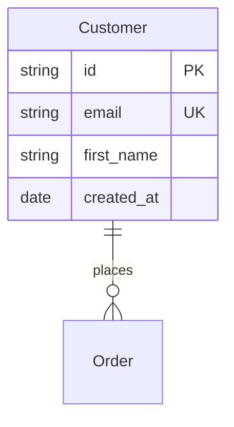
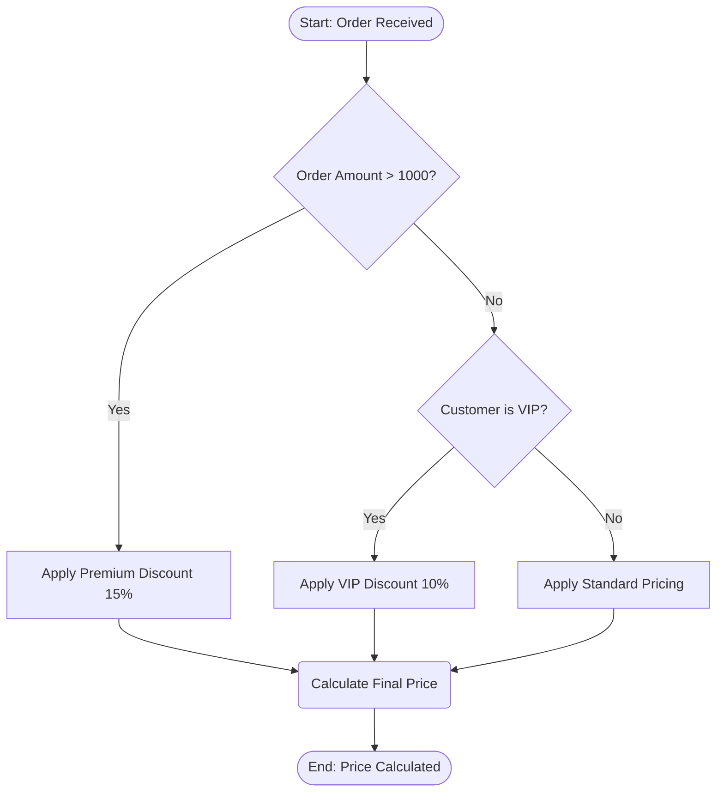
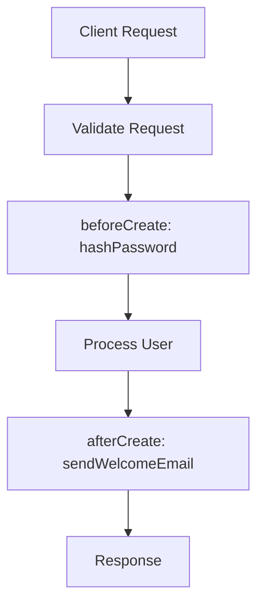

# ERDwithAI Modeling Language (EML)

**EML** is a single, standalone, Mermaid-based language for describing an
application's **Entity Relationship Diagram (ERD)**, its **business rules**, and
its **business workflows** — all in one artifact that the ERDwithAI generator
reads to produce full-stack applications.

Every EML document is **valid, renderable Mermaid**. EML is a *semantic superset*:
it assigns generator meaning to standard Mermaid diagrams (`erDiagram`,
`flowchart`, `stateDiagram-v2`) and to renderer-safe `%%` directive comments.

> Inspired by the official Mermaid references for
> [Entity Relationship Diagrams](https://mermaid.js.org/syntax/entityRelationshipDiagram.html)
> and [Flowcharts](https://mermaid.js.org/syntax/flowchart.html).

---

## The definition file

The **full language** is defined in one machine-readable file that the
generator application reads:

```
language/erdwithai-language.json
```

This JSON is the **single source of truth** for the language: type vocabulary,
modifiers, relationship cardinalities, hook types, rule-node shape semantics,
directives, grammar, and the generator contract. Everything else in this folder
documents or loads that file.

Load it from code via the typed accessor:

```ts
import {
  loadLanguageDefinition,
  normalizeType,
  cardinalityKind,
  isHookType,
} from "../language";

const def = loadLanguageDefinition();
normalizeType("varchar");     // "string"
cardinalityKind("||--o{");    // "oneToMany"
isHookType("beforeCreate");   // true
```

---

## Folder layout

```
language/
├── README.md                     # This entry point
├── erdwithai-language.json       # ⭐ Canonical, machine-readable definition (the language)
├── index.ts                      # Typed loader/accessor for the generator app
├── grammar/
│   └── erdwithai.ebnf            # Formal EBNF grammar
├── spec/
│   ├── 00-overview.md            # Concepts, document structure, sections
│   ├── 01-erd.md                 # ERD reference
│   ├── 02-business-rules.md      # Business-rules (decision-flow) reference
│   ├── 03-workflows.md           # Workflow (hooks + state) reference
│   ├── 04-types-and-modifiers.md # Type vocabulary, modifiers, cardinalities
│   └── 05-directives.md          # Reserved %% directive reference
└── examples/
    ├── crm.eml.mmd               # Full CRM model (ERD + rules + workflows)
    ├── ecommerce.eml.mmd         # Full e-commerce model
    └── minimal.eml.mmd           # Smallest complete example
```

---

## The three sections at a glance

### 1. ERD — structure



Parsed by `packages/generator/src/parsers/mermaid.parser.ts`.

### 2. Business rules — declarative decision logic



Node **shape** = decision role → compiled to a GoRules **JDM** graph by
`packages/web/src/lib/jdm-converter.ts`.

### 3. Workflows — lifecycle hooks & process orchestration



`%%hook` directives are parsed by
`packages/web/src/lib/workflow/hook-parser.ts` and wired into the generated
service lifecycle.

---

## Conformance levels

| Level | Covers | Status |
|-------|--------|--------|
| **core** | `erDiagram` entities, attributes, `PK/FK/UK/OPTIONAL`, cardinalities | Shipped parser |
| **rules** | `flowchart` decision flows → JDM via shape semantics | Shipped parser |
| **workflow-hooks** | `%%hook` directives | Shipped parser |
| **extended** | `%%meta/%%entity/%%field/%%enum/%%index/%%rule/%%guard/%%trigger/%%workflow`, `stateDiagram-v2` | Reserved, renderer-safe, adopted incrementally |

See `spec/` for the full reference and `erdwithai-language.json` for the
authoritative, machine-readable contract.
