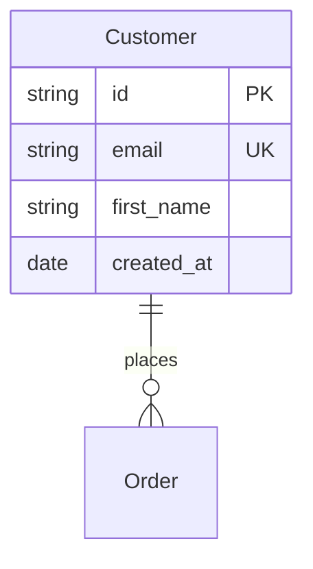
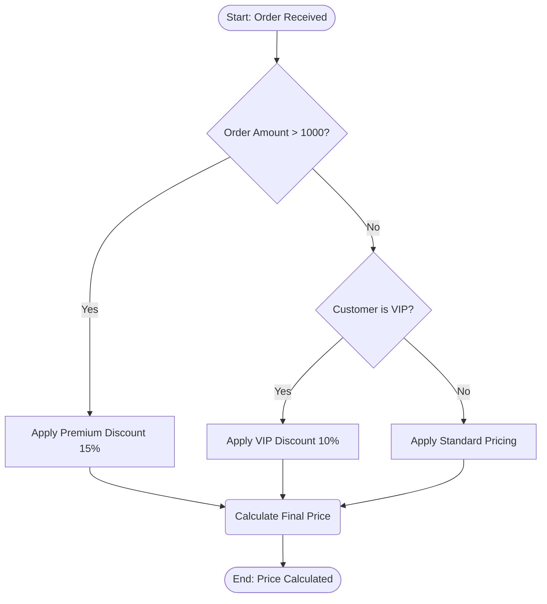
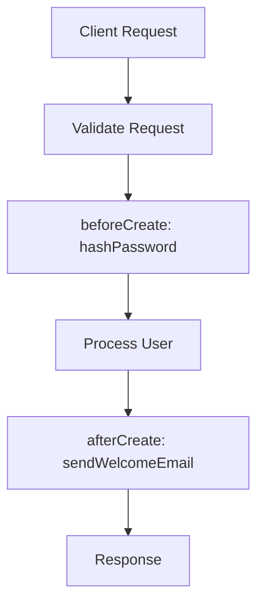

# ERDwithAI Modeling Language (EML)

**EML** is a single, standalone, Mermaid-based language for describing an
application's **Entity Relationship Diagram (ERD)**, its **business rules**, and
its **business workflows** — all in one artifact that the ERDwithAI generator
reads to produce full-stack applications.

Every EML document is **valid, renderable Mermaid**. EML is a *semantic superset*:
it assigns generator meaning to standard Mermaid diagrams (`erDiagram`,
`flowchart`, `stateDiagram-v2`) and to renderer-safe `%%` directive comments.

> Inspired by the official Mermaid references for
> [Entity Relationship Diagrams](https://mermaid.js.org/syntax/entityRelationshipDiagram.html)
> and [Flowcharts](https://mermaid.js.org/syntax/flowchart.html).

---

## The definition file

The **full language** is defined in one machine-readable file that the
generator application reads:

```
language/erdwithai-language.json
```

This JSON is the **single source of truth** for the language: type vocabulary,
modifiers, relationship cardinalities, hook types, rule-node shape semantics,
directives, grammar, and the generator contract. Everything else in this folder
documents or loads that file.

Load it from code via the typed accessor:

```ts
import {
  loadLanguageDefinition,
  normalizeType,
  cardinalityKind,
  isHookType,
} from "../language";

const def = loadLanguageDefinition();
normalizeType("varchar");     // "string"
cardinalityKind("||--o{");    // "oneToMany"
isHookType("beforeCreate");   // true
```

---

## Folder layout

```
language/
├── README.md                     # This entry point
├── erdwithai-language.json       # ⭐ Canonical, machine-readable definition (the language)
├── index.ts                      # Typed loader/accessor for the generator app
├── composer.ts                   # Writes a complete EML document (composeEml, mergeSections)
├── rag.ts                        # EML → retrieval chunks; copied into generated apps verbatim
├── checker.ts                    # Validator — `bun language/checker.ts <file.mmd>`
├── fixer.ts                      # Applies the checker's auto-fixable codes
├── grammar/
│   └── erdwithai.ebnf            # Formal EBNF grammar
├── spec/
│   ├── 00-overview.md            # Concepts, document structure, sections
│   ├── 01-erd.md                 # ERD reference
│   ├── 02-business-rules.md      # Business-rules (decision-flow) reference
│   ├── 03-workflows.md           # Workflow (hooks + state) reference
│   ├── 04-types-and-modifiers.md # Type vocabulary, modifiers, cardinalities
│   └── 05-directives.md          # Reserved %% directive reference
├── cli/                          # The `eml` CLI — parse, validate, generate apps
│   ├── README.md
│   ├── eml.ts                    # Executable entrypoint (run with Bun)
│   ├── src/                      # parser, validator, model, generators
│   └── runtime/                  # static runtime for generated apps
└── examples/
    ├── crm.eml.mmd               # Enterprise CRM — the reference model: 17 entities,
    │                             #   8 rules, 5 state machines, 6 hook workflows, 5 sagas
    ├── ecommerce.eml.mmd         # Full e-commerce model
    ├── helpdesk.eml.mmd          # Support-ticketing model (used by the CLI test)
    └── minimal.eml.mmd           # Smallest complete example
```

## The `eml` CLI — build an app from a model

The [`cli/`](cli/README.md) folder holds a zero-dependency TypeScript CLI that
reads this definition, parses an `.mmd` model, validates it **with
self-correction**, and **generates a complete, runnable application**:

```bash
bun language/cli/eml.ts validate -i language/examples/helpdesk.eml.mmd
bun language/cli/eml.ts generate -i language/examples/helpdesk.eml.mmd -o ./out --docker
cd out && npm start        # zero-dependency app on http://localhost:3000
```

It supports `--input`, `--output`, `--name`, `--docker`, `--github <owner/repo>`,
`--stack`, `--force`, `--no-autofix`, `--json`, and `--help`. See
[`cli/README.md`](cli/README.md).

The shipped ERD parser
(`packages/generator/src/parsers/mermaid.parser.ts`) also loads its type and
cardinality maps from `erdwithai-language.json` at runtime, so the generator and
the language definition never drift.

---

## The three sections at a glance

### 1. ERD — structure


```mermaid
erDiagram
    Customer {
        string id PK
        string email UK
        string first_name
        date   created_at
    }
    Customer ||--o{ Order : "places"
```

Parsed by `packages/generator/src/parsers/mermaid.parser.ts`.

### 2. Business rules — declarative decision logic


```mermaid
%%meta kind: rules
flowchart TD
    A([Start: Order Received]) --> B{Order Amount > 1000?}
    B -->|Yes| C[Apply Premium Discount 15%]
    B -->|No| D{Customer is VIP?}
    D -->|Yes| E[Apply VIP Discount 10%]
    D -->|No| F[Apply Standard Pricing]
    C --> G(Calculate Final Price)
    E --> G
    F --> G
    G --> H([End: Price Calculated])
```

Node **shape** = decision role → compiled to a GoRules **JDM** graph by
`packages/generator/src/rules/jdm-converter.ts`. A section carrying `%%action`
directives compiles to a JDM *decision table* instead — that is the shape the
rules engine reads actions from.

### 3. Workflows — lifecycle hooks & process orchestration


```mermaid
%%meta kind: workflow
%%workflow SignupFlow entity: User kind: hook
flowchart TD
    A[Client Request] --> B[Validate Request]
    B --> C[beforeCreate: hashPassword]
    C --> D[Process User]
    D --> E[afterCreate: sendWelcomeEmail]
    E --> F[Response]

    %%hook beforeCreate hashPassword on User
    %%hook afterCreate sendWelcomeEmail on User
```

`%%hook` directives are compiled by `packages/generator/src/hooks/index.ts`
into per-entity handler modules plus a registry the generated bus service calls
around every CRUD operation.

The web app keeps its own parsers for the editors — they run in the browser and
cannot import the generator. They read the same syntax but do not decide what is
generated; when the two disagree, the generator's copy is the language.

---

## Conformance levels

| Level | Covers | Status |
|-------|--------|--------|
| **core** | `erDiagram` entities, attributes, `PK/FK/UK/OPTIONAL/NULL/UNIQUE`, all 8 cardinalities, plus `%%index`, `%%enum`, `%%field enum:` and `%%category` | Compiled |
| **rules** | `flowchart` decision flows → JDM via shape semantics; `%%action` → JDM decision table | Compiled |
| **workflows** | `%%hook` (both forms, all 13 types), `stateDiagram-v2` state machines, `%%workflow kind: saga` with `%%step` and `%%loop` | Compiled |
| **access** | `%%rbac`, in both its CRUD and state-transition forms | Compiled to `sys_operation_access` / `sys_transition_access`, enforced by the generated guard |
| **validated** | `%%entity`, `%%rule`, `%%trigger` | No compiler yet; `checker.ts` enforces syntax so a malformed one fails rather than being dropped |
| **reserved** | `%%field` keys other than `enum:` | Renderer-safe, documented, inert |

Each directive also carries its own `status` and `consumedBy` in
`erdwithai-language.json`, which is authoritative for that directive; the levels
above just group them.

See `spec/` for the full reference and `erdwithai-language.json` for the
machine-readable contract.

For the whole system — the generator, its templates, and what a generated
application contains — see [`../llmtext/llms-full.txt`](../llmtext/llms-full.txt),
which is the same material written as one context file for language models.
