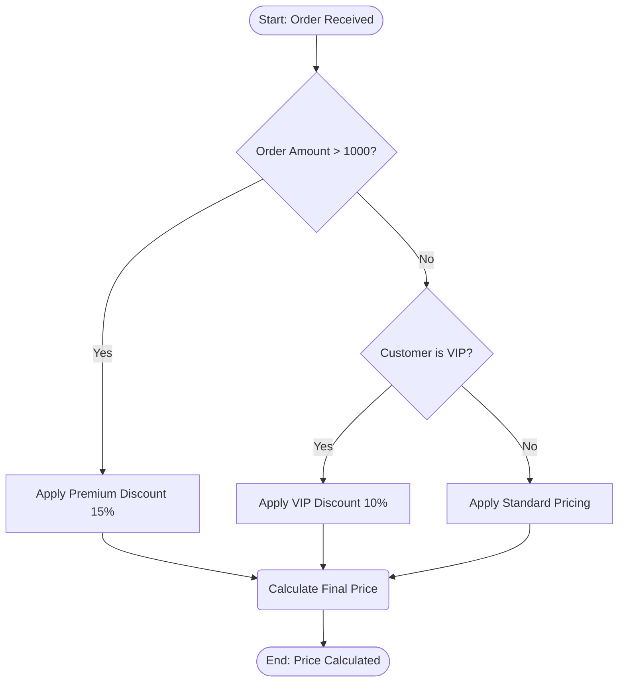
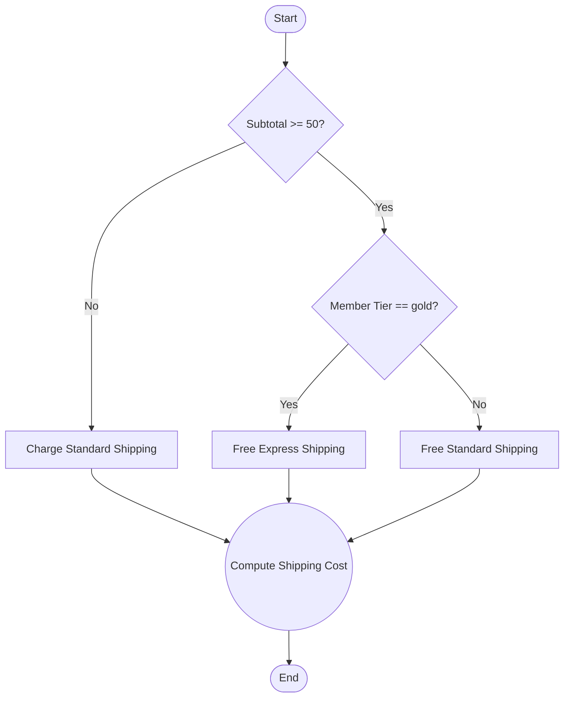

# EML — Business Rules (Decision Flows)

A **business rule** in EML is a directed **decision flow**: a `flowchart` whose
**node shapes** encode decision roles and whose **edge labels** carry branch
conditions. The generator compiles it to a **GoRules JDM** decision graph via
`packages/web/src/lib/mermaid-flowchart-parser.ts` →
`packages/web/src/lib/jdm-converter.ts`.

Use business rules for declarative logic: pricing, discounts, eligibility,
validation, approval routing, scoring.

## Marking a flow as rules

Precede the flowchart with:

```
%%meta kind: rules
```

Absent the marker, a flow with only decision/expression/function/io shapes and
no `%%hook` directives is still treated as rules; otherwise it is a workflow.

## Node shapes → JDM roles

| Mermaid shape | Syntax | JDM role | Meaning |
|---------------|--------|----------|---------|
| Stadium | `A([label])` | `inputNode` / `outputNode` | Start / input context, or End / output. **Output** when it has only incoming edges; otherwise **input**. |
| Diamond | `B{label}` | `switchNode` | Decision / branch. Outgoing edge labels are the branch conditions. |
| Circle | `C((label))` | `functionNode` | Custom function / computation (JS expression or reusable function). |
| Rounded | `D(label)` | `functionNode` | Computation step (e.g. "Calculate Final Price"). |
| Rectangle | `E[label]` | `expressionNode` | Expression / assignment / action (set outputs, apply a value). |

The single stadium shape marks **both** Start and End: a terminal node with only
incoming edges is the decision output, so `A([Start ...])` and `H([End ...])`
resolve to input and output respectively.

## Edges and conditions

```
<SourceId> -->|<label>| <TargetId>
```

- On edges leaving a **decision** (diamond), the label is the **branch
  condition** (`Yes`, `No`, `amount > 1000`, `tier == "gold"`).
- On other edges the label is an optional transition name.
- An unlabeled edge (`C --> G`) is a plain transition.

## Complete rule example — order pricing



Compiles to a JDM graph:

- `A` → `inputNode` (Start)
- `B`, `D` → `switchNode` (decisions)
- `C`, `E`, `F` → `expressionNode` (apply discount / pricing)
- `G` → `functionNode` (calculate)
- `H` → `outputNode` (End)

Each edge becomes a JDM edge; labeled decision edges (`Yes`/`No`) become the
branch conditions of their switch node.

## Another example — shipping eligibility



## Authoring guidance

- Give every flow exactly one Start stadium and at least one End stadium.
- Keep decision labels short and machine-parseable (`Yes`/`No`, or a comparison).
- Prefer expression nodes for "set/apply" actions and function nodes for
  "compute" steps — the distinction maps to JDM `expressionNode` vs
  `functionNode`.
- Bind the rule to an entity + lifecycle event with `%%rule` so the generator
  knows when to evaluate it.
