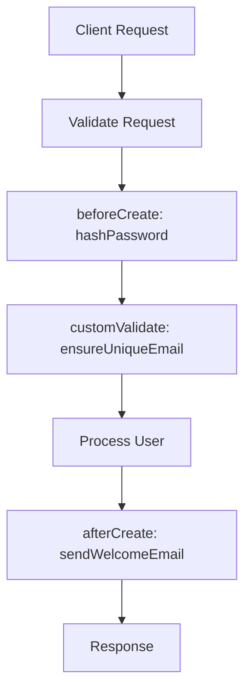
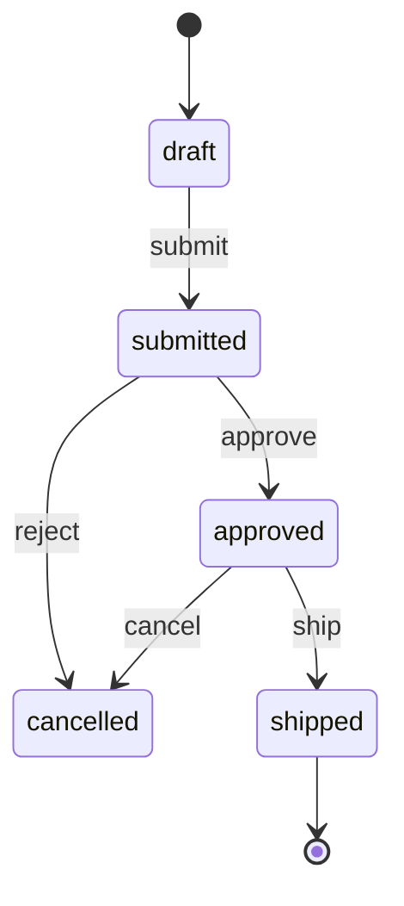

# EML — Business Workflows

A **workflow** describes *process*: the imperative logic that runs around entity
lifecycle events, and the longer-running state a business object moves through.
EML expresses workflows two ways:

1. **Hook workflows** — a `flowchart` annotated with `%%hook` directives that
   bind named handlers to entity CRUD lifecycle events. Parsed by
   `packages/web/src/lib/workflow/hook-parser.ts`.
2. **State workflows** — a `stateDiagram-v2` whose states map to a status enum
   and whose transitions define the allowed status changes for an entity.

## 1. Hook workflows

### The hook directive

```
%%hook <hookType> <handlerName> on <EntityName>[<params>]
```

- `hookType` — one of the 13 lifecycle events (below).
- `handlerName` — `^[a-zA-Z_][a-zA-Z0-9_]*$` (the generated function name).
- `EntityName` — the entity the handler runs for.
- `params` — optional `[field: name, field: name]` to scope the hook to fields.

Examples:

```
%%hook beforeCreate hashPassword on User
%%hook afterCreate  sendWelcomeEmail on User
%%hook beforeCreate generateSlug on Post[field: slug]
%%hook customValidate ensureCreditLimit on Order
```

### The 13 hook types

| Hook | Phase | Op | Typical use |
|------|-------|----|-------------|
| `beforeCreate` | before | create | hash password, generate slug, set defaults |
| `afterCreate` | after | create | welcome email, emit event |
| `beforeUpdate` | before | update | validate/transform before write |
| `afterUpdate` | after | update | audit, cache invalidation |
| `beforeDelete` | before | delete | block delete if referenced |
| `afterDelete` | after | delete | cleanup files/related rows |
| `beforeQuery` | before | query | tenant scoping, filter injection |
| `afterQuery` | after | query | post-process result rows |
| `customValidate` | validate | any | cross-field / business validation |
| `beforeRead` | before | read | guard single-record read |
| `afterRead` | after | read | redact/enrich a record |
| `beforeList` | before | list | adjust filter/sort/pagination |
| `afterList` | after | list | post-process a page of results |

Handlers are wired into the generated `BaseService` and run through
`globalHookExecutor` around the corresponding CRUD operation.

### Complete hook workflow — user signup



The flowchart is the human-readable process; the `%%hook` directives are the
machine-readable binding. The two stay in sync in one artifact.

## 2. State workflows

Use `stateDiagram-v2` for an entity that moves through named states (order
fulfilment, approval, subscription lifecycle).

```
[*]        --> FirstState
StateA     --> StateB : eventName
LastState  --> [*]
```

- States are treated as a **status enum** for the bound entity.
- Transitions define the **allowed status changes**; the transition label is the
  triggering event/action.
- Bind with `%%workflow ... kind: state` and (optionally) guard transitions with
  `%%guard`.

### Complete state workflow — order fulfilment



## Combining hooks, rules, and state

A single entity can carry all three: an ERD block (structure), `%%rule`
decision flows (declarative logic), `%%hook` handlers (imperative side effects),
and a `stateDiagram-v2` (status lifecycle). Keeping them in one EML file makes
the entity's full behavior reviewable in one place — and renderable as diagrams.
See [`examples/crm.eml.mmd`](../examples/crm.eml.mmd).
