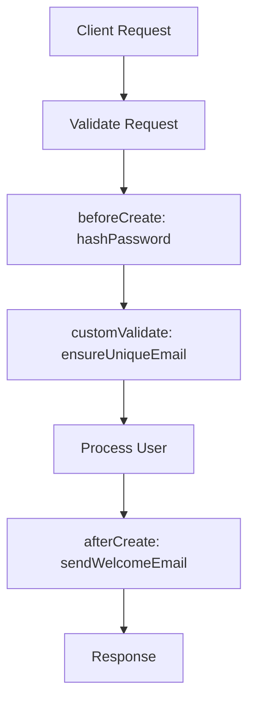
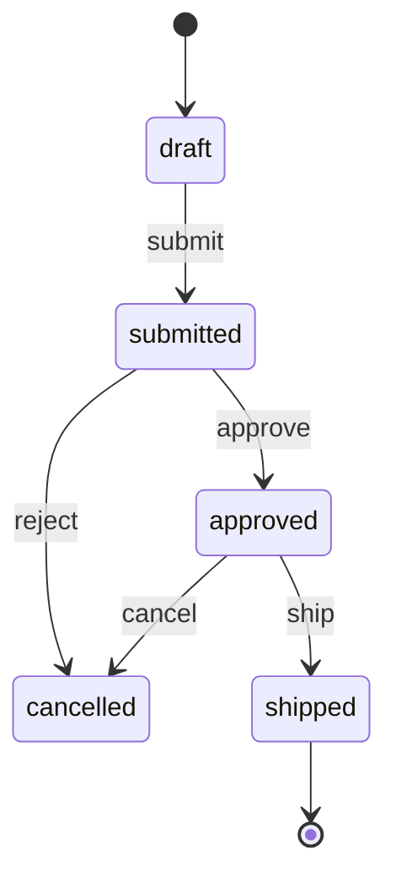
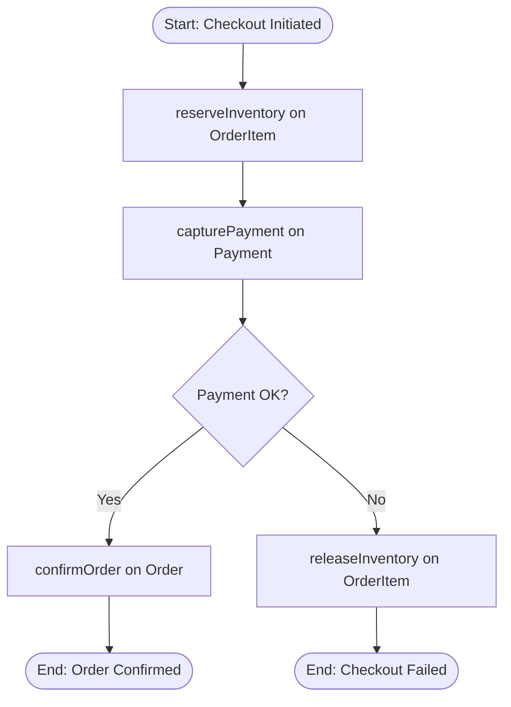

# EML — Business Workflows

A **workflow** describes *process*: the imperative logic that runs around entity
lifecycle events, and the longer-running state a business object moves through.
EML expresses workflows two ways:

1. **Hook workflows** — a `flowchart` annotated with `%%hook` directives that
   bind named handlers to entity CRUD lifecycle events. Parsed by
   `packages/web/src/lib/workflow/hook-parser.ts`.
2. **State workflows** — a `stateDiagram-v2` whose states map to a status enum
   and whose transitions define the allowed status changes for an entity.

## 1. Hook workflows

### The hook directive

```
%%hook <hookType> <handlerName> on <EntityName>[<params>]
```

- `hookType` — one of the 13 lifecycle events (below).
- `handlerName` — `^[a-zA-Z_][a-zA-Z0-9_]*$` (the generated function name).
- `EntityName` — the entity the handler runs for.
- `params` — optional `[field: name, field: name]` to scope the hook to fields.

Examples:

```
%%hook beforeCreate hashPassword on User
%%hook afterCreate  sendWelcomeEmail on User
%%hook beforeCreate generateSlug on Post[field: slug]
%%hook customValidate ensureCreditLimit on Order
```

### What a hook directive generates

Each directive becomes a function in the generated backend, in a module per
entity:

```
backend/src/modules/hooks/
├── handlers/
│   ├── User.ts        # one exported function per handler declared for User
│   └── index.ts       # the registry, generated from the directives
└── hooks.ts           # the executors the bus service calls
```

`handlers/<Entity>.ts` is written **once** and then left alone — the bodies are
application logic, so regenerating the project never overwrites them. A hook
added to the model later is appended to the existing module. `handlers/index.ts`
is pure wiring and is rewritten on every generation.

A handler's signature follows its phase:

| Phase | Receives | Returns |
|-------|----------|---------|
| `before*` | the payload | the payload to use (return it, changed or not) |
| `after*` | the record | nothing — side effects only |
| `beforeDelete` | the id | `false` to block the delete |
| `customValidate` | the record | nothing — **throw** to reject the write |

`customValidate` runs on every create and update, against the record as it will
look after the write, so a validation over a field absent from a partial update
still holds.

The entity a hook binds to is matched however the caller spells it: the REST
route sends `bus_compound`, the UI sends `chemical-inventory`, the model says
`ChemicalInventory` — all three resolve to the same handlers.

### The 13 hook types

| Hook | Phase | Op | Typical use |
|------|-------|----|-------------|
| `beforeCreate` | before | create | hash password, generate slug, set defaults |
| `afterCreate` | after | create | welcome email, emit event |
| `beforeUpdate` | before | update | validate/transform before write |
| `afterUpdate` | after | update | audit, cache invalidation |
| `beforeDelete` | before | delete | block delete if referenced |
| `afterDelete` | after | delete | cleanup files/related rows |
| `beforeQuery` | before | query | tenant scoping, filter injection |
| `afterQuery` | after | query | post-process result rows |
| `customValidate` | validate | any | cross-field / business validation |
| `beforeRead` | before | read | guard single-record read |
| `afterRead` | after | read | redact/enrich a record |
| `beforeList` | before | list | adjust filter/sort/pagination |
| `afterList` | after | list | post-process a page of results |

Handlers are wired into the generated `BaseService` and run through
`globalHookExecutor` around the corresponding CRUD operation.

### Complete hook workflow — user signup


```mermaid
%%meta name: User Signup
%%meta kind: workflow
%%workflow SignupFlow entity: User kind: hook
flowchart TD
    A[Client Request] --> B[Validate Request]
    B --> C[beforeCreate: hashPassword]
    C --> D[customValidate: ensureUniqueEmail]
    D --> E[Process User]
    E --> F[afterCreate: sendWelcomeEmail]
    F --> G[Response]

    %%hook beforeCreate hashPassword on User[field: password]
    %%hook customValidate ensureUniqueEmail on User[field: email]
    %%hook afterCreate sendWelcomeEmail on User
```

The flowchart is the human-readable process; the `%%hook` directives are the
machine-readable binding. The two stay in sync in one artifact.

## 2. State workflows

Use `stateDiagram-v2` for an entity that moves through named states (order
fulfilment, approval, subscription lifecycle).

```
[*]        --> FirstState
StateA     --> StateB : eventName
LastState  --> [*]
```

- States are treated as a **status enum** for the bound entity.
- Transitions define the **allowed status changes**; the transition label is the
  triggering event/action.
- Bind with `%%workflow ... kind: state` and (optionally) guard transitions with
  `%%guard`.

### What a state workflow generates

Each state workflow becomes a row in `sys_workflow_definitions`, holding BPMN the
generated backend executes. The generator already seeds a `trigger-workflow` rule
per entity for create and update; those rules resolve a definition **by name**
(`<table>-on-create-workflow`), so one is seeded for every entity:

| The model declares | The generated definition does |
|--------------------|-------------------------------|
| a state machine for the entity | puts a new record into the starting state — the `[*] --> x` edge — writing `x` to the entity's `status` column, or `workflow_status` when it has none |
| nothing for that entity | runs a single no-op, so the workflow run still exists and is visible in the run list |

The full machine (every state and transition, with its trigger labels) is recorded
in the definition's description, so the Workflow Designer shows what was drawn.

Without the definitions, every write logged *"No active workflow named … —
nothing to trigger"* and no run was ever recorded.

### Complete state workflow — order fulfilment


```mermaid
%%meta name: Order Fulfilment
%%meta kind: workflow
%%workflow OrderFulfilment entity: Order kind: state
%%enum OrderStatus: draft, submitted, approved, shipped, cancelled
stateDiagram-v2
    [*] --> draft
    draft     --> submitted : submit
    submitted --> approved  : approve
    submitted --> cancelled : reject
    approved  --> shipped   : ship
    approved  --> cancelled : cancel
    shipped   --> [*]

    %%guard role:sales|manager on Order.update
    %%guard role:manager on Order.approve
    %%trigger webhook:carrier -> markShipped on Order
```

## 3. Saga workflows

Use `%%workflow ... kind: saga` for multi-entity, multi-step processes that span
several services or require compensating transactions (e.g. order checkout,
patient admission, loan approval).

A saga is expressed as a `flowchart` whose nodes represent steps involving
**different entities**; each step can carry a `%%hook` directive that fires on
the relevant entity.


```mermaid
%%meta name: Checkout Saga
%%meta kind: workflow
%%workflow CheckoutSaga entity: Order kind: saga
flowchart TD
    A([Start: Checkout Initiated]) --> B[reserveInventory on OrderItem]
    B --> C[capturePayment on Payment]
    C --> D{Payment OK?}
    D -->|Yes| E[confirmOrder on Order]
    D -->|No| F[releaseInventory on OrderItem]
    E --> G([End: Order Confirmed])
    F --> H([End: Checkout Failed])

    %%hook beforeCreate reserveInventory on OrderItem
    %%hook afterCreate capturePayment on Payment
    %%hook afterUpdate confirmOrder on Order
    %%hook afterDelete releaseInventory on OrderItem
```

Saga nodes that need compensation (rollback) should be paired: one forward hook
and one compensating hook (typically `afterDelete` or a `customValidate`).

> **Status:** saga is a reserved `kind` value — the visual diagram renders today
> and the `%%hook` directives are parsed, but orchestration of compensating
> transactions is part of the generator's extended conformance surface and adopted
> incrementally.

## Combining hooks, rules, and state

A single entity can carry all three: an ERD block (structure), `%%rule`
decision flows (declarative logic), `%%hook` handlers (imperative side effects),
and a `stateDiagram-v2` (status lifecycle). Keeping them in one EML file makes
the entity's full behavior reviewable in one place — and renderable as diagrams.
See [`examples/crm.eml.mmd`](../examples/crm.eml.mmd).
